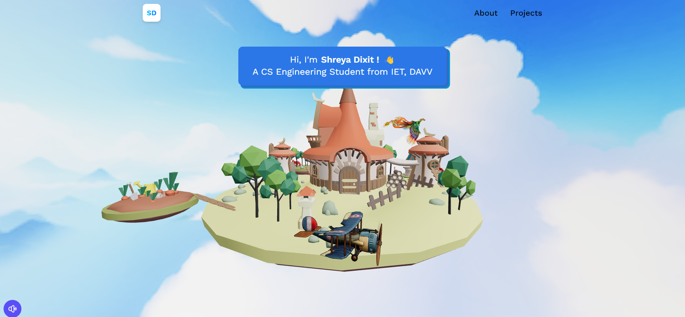

    
  <h3 align="center">3D Island Portflio</h3>

##    📋 <a name="table">Table of Contents</a>

- ✨ [Introduction](#introduction)
- ⚙️ [Tech Stack](#tech-stack)
- 🚀 [Quick Start](#quick-start)

##    <a name="introduction">✨ Introduction</a>

**[EN]** This 3D website, built with React and powered by Three.js, features engaging interactive elements. Navigate aboard a small plane to explore a floating island and discover various information. On the contact page, a fox will dynamically react as you fill out the fields!

##    <a name="tech-stack">⚙️ Tech Stack</a>

- [**React**](https://react.dev/reference/react) is a JavaScript library for building user interfaces. It allows developers to create reusable UI components and efficiently manage application state.

- [**Three.js**](https://threejs.org/docs/) is a React binding to Three.js, enabling developers to integrate powerful 3D graphics and visualizations into React applications seamlessly.

- [**Three Drei**](https://github.com/pmndrs/drei) is a collection of useful helpers and abstractions for React Three.js applications. It provides components like effects, shaders, and pre-built 3D objects to simplify development.

- [**Three Fiber**](https://docs.pmnd.rs/react-three-fiber/getting-started/introduction) optimizes the React binding for Three.js, utilizing React's reconciliation algorithm (Fiber) to efficiently manage and update the 3D scene graph.

- [**Vite**](https://vitejs.dev/guide/) is a modern build tool that prioritizes speed and efficiency for frontend development. It offers rapid server start-up, instant hot module replacement (HMR), and supports modern JavaScript features out of the box.

- [**Tailwind**](https://v2.tailwindcss.com/docs) is a utility-first CSS framework that facilitates rapid UI development by applying pre-defined utility classes directly in HTML markup, eliminating the need for writing custom CSS.

- [**EmailJS**](https://www.emailjs.com/docs/examples/reactjs/) is a service that simplifies email sending from client-side JavaScript applications. It provides APIs for integrating email functionality without backend setup, making it easier to manage email communication in frontend projects.

